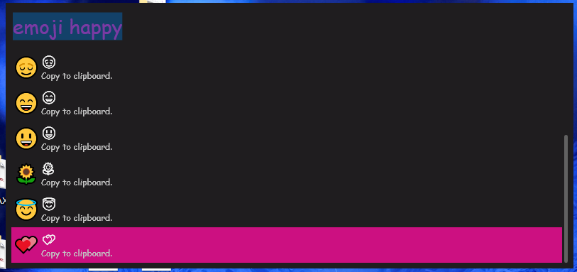

# Wox.Plugin.Emoji

## Usage

1. Alt Enter to launch Wox
2. type 'emoji' and your keyword to search
3. Press Enter or click on the result to copy to clipboard

## Python script to generate icons

In order to solve [the outline render issue](https://answers.microsoft.com/en-us/msoffice/forum/msoffice_word-mso_win10-mso_2016/unicode-character-appears-colored-on-screen-prints/b3cb3a63-df41-4f94-b34b-2c69b207cc32
) on Windows platform, we came up with an alternative method to display the Emojis with .png icons. However, due to license limitation, there is no API that we can call to obtain an image correspond with the selected Emoji. Therefore we cached the most common 1200 Emoji icons from https://emojipedia.org/microsoft/ to display in Wox. Since there might be an update on Emoji icons in 2018/10, you might need to update the icon set manually.

1. download all the icon png from anywhere that does not violate the copyright
2. write your own code or use this specific Python code to rename icon pngs into valid naming pattern. i.e. those icons whose Unicode is less than 0x1F600 should be written in decimal number, and the latter ones in Unicode character itself.

In folder Pyscript provided a links list and a Python script to do this task. Download all the icon png in ./icons directory and run the script.
